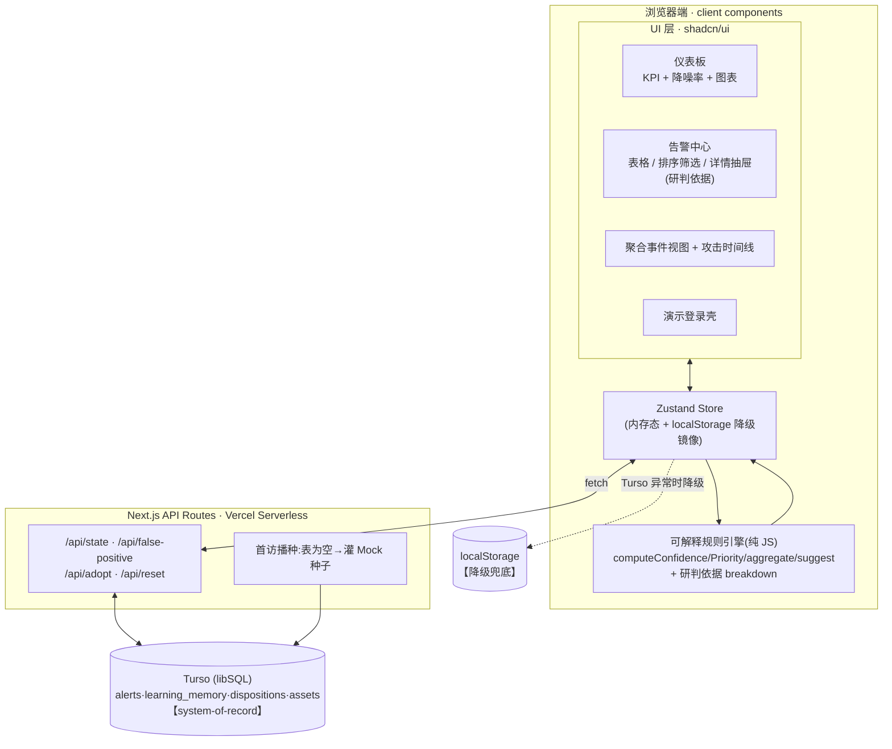

# 技术方案 · 题目 D — AI SOC 安全运营看板(智能研判版)

> 国舜技术部 Vibe Coding 实战竞赛 · 两周挑战
> 版本 **v1.2** ｜ 编制日期 2026-06-08

> **v1.2 变更**(采纳 Codex 评审 + 修正持久化决策):
> ① 持久化改为 **Turso(libSQL)为 system-of-record + localStorage 降级兜底**,经 下一页.js API Routes 读写——消解"持久化到数据库"的字面要求与"偷换概念"信任风险;
> ② 引擎对外定位升级为「**可解释规则引擎**」:UI 展示研判依据(置信度构成 / 命中规则 / 学习前后变化),而非"假 AI/纯模拟";
> ③ 新增第五节「数据库设计」(`alerts` / `learning_memory` / `dispositions` / `assets`);
> ④ 新增「演示脚本(3 条必演路径)」「演示登录壳」两节;
> ⑤ 仪表板加「降噪率」卡片;Vibe Coding 落为 4 个交付文件;README 加评分对照表;
> ⑥ 锁定 下一页.js 15 稳定版、钉死依赖版本(不追 canary)。
>
> **v1.1 变更**:补 `AlertFilters`;新增 Mock 种子设计与首访自动播种;误报学习加下限;页面补详情抽屉/重置按钮;Vibe Coding 捕获计划;排期记录前移。

---

## 一、选题理由(为什么是 D)

| 维度 | 说明 |
|---|---|
| **完全满足要求** | 检查清单 7 项满足即满分,边界最清晰;PDF 官方背书"AI 能力均用前端 JS 模拟、聚合用分组函数、预置 10~20 条告警即可"。 |
| **真数据库交付** | Turso(libSQL)持久化告警/误报学习/处置记录,**字面满足"持久化到数据库"**,无解读争议。 |
| **高分高 impact** | 最贴合国舜安全运营主业(SOC、降噪、智能研判),评委大概率安全背景,印象分高。 |
| **技术风险可控** | "AI 能力"是确定性可解释规则函数,无真模型;Turso + localStorage 双层兜底,演示不空屏。 |

---

## 二、技术栈

| 类别 | 选型 | 理由 |
|---|---|---|
| 框架 | **下一页。js 15(稳定版,钉死依赖,不追 canary)** | PDF 推荐栈,Vercel 原生;含 API Routes 作后端 |
| 语言 | **TypeScript** | 类型优先,契约清晰 |
| 样式 | **Tailwind CSS** | PDF 推荐 |
| 组件库 | **shadcn/ui** | 表格/卡片/对话框/抽屉/侧边栏开箱即用 |
| 图表 | **recharts**(shadcn Chart 封装) | 满足"至少一个图表" |
| 状态管理 | **Zustand + persist** | 内存 UI 状态 + localStorage 镜像(降级缓存) |
| **持久化(主)** | **Turso (libSQL) + `@libsql/client`** | serverless SQLite,免费额度大,Vercel 兼容,真数据库 |
| **持久化(降级)** | **localStorage** | Turso/网络异常时兜底,演示永不空屏 |
| 后端 | **下一页。js API Routes** | `/api/*` 读写 Turso,服务端首访播种 |
| 部署 | **Vercel** | 免费,GitHub 推送自动部署(+2 个 Turso 环境变量) |

---

## 三、系统架构



**数据流**:`首访 → GET /api/state(空则播种)→ Turso 返回原始告警/学习记忆/处置 → 客户端引擎派生置信度/优先级/建议/聚合 → 渲染。用户操作(误报/采纳)→ POST /api/* 写 Turso → 回写 Store → 引擎重算 → UI 更新。API 异常 → 降级读 localStorage 镜像 + 顶部"降级模式"提示。`

> **引擎放客户端**:研判是纯函数,放客户端便于"可解释"展示且逻辑单点;**持久化的是原始数据**(告警/状态/学习记忆/处置)→ 落在 Turso,字面满足"数据库"要求。

---

## 四、数据模型(TypeScript 契约 · Type-First)

```typescript
type Severity = 'critical' | 'high' | 'medium' | 'low';
type Priority = 'P0' | 'P1' | 'P2' | 'P3';
type AlertStatus = 'pending' | 'adopted' | 'false_positive';
type AlertType =
  | 'brute_force' | 'port_scan' | 'sql_injection'
  | 'malware_callback' | 'web_scan' | 'xss' | 'priv_escalation';

interface Asset { ip: string; name: string; importance: 1 | 2 | 3; department: string; }

interface Alert {
  id: string; name: string; alertType: AlertType;
  sourceIp: string; destIp: string; severity: Severity; timestamp: string; // ISO8601
  status: AlertStatus;
  // —— 运行时由引擎派生(不入库)——
  confidence: number; priority: Priority; aiSuggestion: string | null;
  breakdown: ConfidenceBreakdown; // 可解释:研判依据
}

// 可解释规则引擎核心:置信度构成,供 UI"研判依据卡片"展示
interface ConfidenceBreakdown {
  base: number;            // 告警类型基线
  importanceBonus: number; // 资产重要性加权 (+0/5/10)
  severityBonus: number;   // 严重度加权
  learningAdj: number;     // 误报学习调整(负值)
  final: number;           // clamp(0,100)
  hitRule: string;         // 命中的主规则文字,如"同源高频认证失败"
}

interface AggregatedEvent {
  id: string; sourceIp: string; alertType: AlertType; alertIds: string[];
  count: number; firstSeen: string; lastSeen: string;
  maxConfidence: number; priority: Priority;
  timeline: { time: string; alertName: string }[];
}

type LearningMemory = Partial<Record<AlertType, number>>;

interface DispositionRecord {
  id: string; alertId: string; alertName: string;
  action: string; operator: string; timestamp: string;
}

interface AlertFilters {
  severity?: Severity; priority?: Priority; status?: AlertStatus;
  sortBy: 'confidence' | 'priority' | 'timestamp';
  sortOrder: 'asc' | 'desc';
}

interface SocState {
  assets: Asset[]; alerts: Alert[]; learningMemory: LearningMemory;
  dispositions: DispositionRecord[]; viewMode: 'raw' | 'aggregated';
  filters: AlertFilters; connectionMode: 'online' | 'fallback';
  // actions(均经 API → Turso,失败降级 localStorage)
  hydrateFromServer: () => Promise<void>;
  recomputeAll: () => void;
  markFalsePositive: (alertId: string) => Promise<void>;
  markTruePositive: (alertId: string) => Promise<void>;
  adoptSuggestion: (alertId: string) => Promise<void>;
  setFilters: (patch: Partial<AlertFilters>) => void;
  toggleViewMode: () => void;
  resetSeed: () => Promise<void>;
}
```

---

## 五、数据库设计(Turso / libSQL)

> 持久化**原始数据**;研判结果(置信度/优先级/建议/聚合)运行时派生,不入库。

```sql
-- 资产
CREATE TABLE IF NOT EXISTS assets (
  ip TEXT PRIMARY KEY, name TEXT NOT NULL,
  importance INTEGER NOT NULL, department TEXT NOT NULL
);
-- 原始告警(含处置状态)
CREATE TABLE IF NOT EXISTS alerts (
  id TEXT PRIMARY KEY, name TEXT NOT NULL, alert_type TEXT NOT NULL,
  source_ip TEXT NOT NULL, dest_ip TEXT NOT NULL,
  severity TEXT NOT NULL, timestamp TEXT NOT NULL,
  status TEXT NOT NULL DEFAULT 'pending'   -- pending|adopted|false_positive
);
-- 误报学习记忆(模拟学习的持久化核心)
CREATE TABLE IF NOT EXISTS learning_memory (
  alert_type TEXT PRIMARY KEY,
  adjustment INTEGER NOT NULL DEFAULT 0    -- 负值,下限 -45
);
-- 处置历史
CREATE TABLE IF NOT EXISTS dispositions (
  id TEXT PRIMARY KEY, alert_id TEXT NOT NULL, alert_name TEXT NOT NULL,
  action TEXT NOT NULL, operator TEXT NOT NULL, timestamp TEXT NOT NULL
);
-- (可选)聚合快照,默认不用,聚合为运行时派生
-- CREATE TABLE aggregated_events_snapshot (...);
```

**首访播种**:`GET /api/state` 时若 `SELECT count(*) FROM alerts == 0` → 批量插入 `SEED_ASSETS + SEED_ALERTS + learning_memory 初始 0`。

---

## 六、可解释规则引擎 · 核心算法(伪代码)

### 6.1 置信度评分 + 研判依据 `computeConfidence`

```text
BASE_CONFIDENCE = { malware_callback:90, sql_injection:85, priv_escalation:82,
                    brute_force:72, xss:60, port_scan:48, web_scan:38 }
SEVERITY_BONUS  = { critical:+10, high:+5, medium:0, low:-5 }
HIT_RULE        = { brute_force:"同源高频认证失败", port_scan:"短时多端口探测",
                    sql_injection:"参数含注入特征", malware_callback:"周期性外联可疑域名", ... }

function computeConfidence(alert, learningMemory, assetMap) -> {confidence, breakdown}:
    base   = BASE_CONFIDENCE[alert.alertType] ?? 50
    asset  = assetMap[alert.destIp]
    impB   = asset ? (asset.importance - 1) * 5 : 0
    sevB   = SEVERITY_BONUS[alert.severity]
    learn  = learningMemory[alert.alertType] ?? 0
    final  = clamp(round(base + impB + sevB + learn), 0, 100)
    return { confidence: final,
             breakdown: { base, importanceBonus:impB, severityBonus:sevB,
                          learningAdj:learn, final, hitRule:HIT_RULE[alert.alertType] } }
```
> **可解释展示**(详情抽屉):`置信度 82 = 基线 72(暴力破解) + 资产权重 +10(核心库) + 严重度 +5(high) + 学习调整 0｜命中规则:同源高频认证失败`

### 6.2 优先级 `computePriority`

```text
function computePriority(alert, confidence, assetMap):
    imp = assetMap[alert.destIp]?.importance ?? 1
    score = imp/3*0.5 + confidence/100*0.5
    if alert.severity == 'critical': score += 0.15
    if score>=0.80 or (imp==3 and confidence>=80): return 'P0'
    if score>=0.62: return 'P1'
    if score>=0.45: return 'P2'
    return 'P3'
```

### 6.3 处置建议 `generateSuggestion`(仅高置信高优先级)

```text
function generateSuggestion(alert):
    if alert.confidence>80 and alert.priority in ['P0','P1']:
        return interpolate(TEMPLATES[alert.alertType] ?? "建议人工研判 {sourceIp} 行为", alert)
    return null
// 模板示例:brute_force → "建议临时封禁源IP {sourceIp} 1小时,并强制 {destIp} 重置弱口令"
```

### 6.4 智能聚合 `aggregate`(同源IP + 同类型,误报不计)

```text
function aggregate(alerts):
    active = alerts.filter(a => a.status != 'false_positive')
    groups = groupBy(active, a => a.sourceIp + "::" + a.alertType)
    return groups.filter(g => g.length>=2).map(g => ({
        sourceIp, alertType, alertIds:g.map(id), count:g.length,
        firstSeen:min(time), lastSeen:max(time), maxConfidence:max(conf),
        priority:highestPriority(g),
        timeline: sortByTime(g).map(a=>({time:a.timestamp, alertName:a.name}))
    }))
```

### 6.5 误报标注 + 模拟学习 `markFalsePositive`(全场最大亮点)

```text
LEARNING_DELTA = 15;  LEARNING_FLOOR = -45

async function markFalsePositive(alertId):
    await POST /api/false-positive { alertId }     // 服务端写 Turso:
        // 1) UPDATE alerts SET status='false_positive' WHERE id=alertId
        // 2) UPSERT learning_memory: adjustment = max(adjustment - 15, -45)
    await hydrateFromServer()                       // 重新拉取 → 引擎重算同类告警 → UI 更新
// 双向学习(可选):markTruePositive 让 adjustment 回升(上限 0)
```
> **演示效果**:对某条 `port_scan` 点"误报"→ 所有 `port_scan` 置信度同步下降、优先级降级、建议消失;**刷新后仍生效(已落 Turso)**。

---

## 七、Mock 种子数据设计(决定演示效果)

### 7.1 资产表(6 个,覆盖 importance 1/2/3)

```typescript
const SEED_ASSETS: Asset[] = [
  { ip:'10.0.1.100', name:'核心数据库服务器', importance:3, department:'技术部' },
  { ip:'10.0.1.102', name:'财务系统服务器',   importance:3, department:'财务部' },
  { ip:'10.0.1.101', name:'OA 系统服务器',     importance:2, department:'行政部' },
  { ip:'10.0.1.103', name:'官网 Web 服务器',   importance:2, department:'市场部' },
  { ip:'10.0.2.50',  name:'测试环境服务器',   importance:1, department:'技术部' },
  { ip:'10.0.2.51',  name:'内部 Wiki',         importance:1, department:'技术部' },
];
```

### 7.2 告警表(约 16 条,4 类场景)

| 场景 | 构造 | 预期研判 | 聚合 |
|---|---|---|---|
| ① 暴破打核心库 | `192.168.100.5`→`10.0.1.100`,5 条 `brute_force` | 高置信、**P0** | 5→**1 事件** + 时间线 |
| ② 端口扫描 | `10.99.0.33`→`10.0.1.103`,3 条 `port_scan` | 中置信、P2/P3 | 3→**1 事件**(误报演示首选) |
| ③ 独立注入(不聚合) | 2 条 `sql_injection`,**不同源IP** | 高置信、P0/P1 | 源不同→**各自独立** |
| ④ 恶意外联 | `10.0.2.50`→外部,1 条 `malware_callback` | 最高置信(90)、P0 | 单条,**触发建议** |
| 填充 | `web_scan`/`xss`/`priv_escalation` 各 1+ | 覆盖 P3~P0 全谱 | 多独立 |

**预期效果**:原始 16 条 → 聚合后约 **9~10 事件**(降噪率约 40%,进仪表板)。

---

## 八、页面与路由拆解

| 路由 | 页面 | 核心组件 | 检查项 |
|---|---|---|---|
| `/login` | **演示登录壳** | 账号选择(admin/security/user1)、密码 123456、无真鉴权 | — |
| `/` | **仪表板** | KPI×4 + **降噪率卡片** + 优先级饼图 + 置信度柱状 + 高危 Top5 + 最近处置 | 5、6 |
| `/alerts` | **告警中心** | `AlertFilters` 排序筛选、增强表格、`[原始/聚合]` 切换、`[误报]/[采纳]`、**详情抽屉(研判依据卡片)** | 1、2、3、4 |
| `/events` | **聚合事件视图** | 事件卡片 + 攻击时间线抽屉 | 2、8 |
| `/dispositions` | **处置历史** | 采纳记录表格 | 佐证 3 |

- **降噪率卡片**(Codex 建议):`降噪率 = 1 − 聚合事件数 / 原始告警数`,直观体现 SOC 价值。
- **研判依据卡片**(可解释引擎核心):详情抽屉展示置信度构成 + 命中规则 + 误报学习前后值。
- **重置演示数据按钮**:调 `resetSeed()`(POST /api/reset 重灌种子),方便反复演示。
- **降级提示 banner**:`connectionMode==='fallback'` 时顶部提示"当前为本地降级模式"。
- **布局**:`shadcn Sidebar` + 顶栏 + 主区,暗色 SOC 风格。

---

## 九、状态管理与持久化(Turso 主 + localStorage 降级)

```typescript
// lib/turso.ts —— 服务端连接(仅 API Routes 使用)
import { createClient } from '@libsql/client';
export const db = createClient({
  url: process.env.TURSO_DATABASE_URL!,
  authToken: process.env.TURSO_AUTH_TOKEN!,
});

// store/socStore.ts —— 客户端:在线拉 API,异常降级 localStorage 镜像
// hydrateFromServer(): try GET /api/state → set(online); catch → 读 localStorage(fallback)
// 写操作:POST /api/* 成功 → 乐观更新 + 持久化镜像;失败 → 标记 fallback + banner
```

- **Turso 为 system-of-record**:告警状态、误报学习、处置记录均写入 Turso → **字面满足"持久化到数据库"**。
- **localStorage 仅降级兜底**:Turso/网络异常时读本地镜像,演示永不空屏;不再宣称 localStorage"满足数据库项"。
- **首访播种**:服务端 `GET /api/state` 检测 `alerts` 表为空 → 灌入种子 → 保证任何新浏览器打开即满屏。
- **README「技术决策说明」**:记录"为何 Turso 而非本地 SQLite(Vercel serverless 只读文件系统)"——这是一条优质 Vibe Coding「AI 解决的技术问题」素材。

---

## 十、演示脚本(3 条必演路径 · Codex 建议)

> 演示前固定走这 3 条,确保一次覆盖核心检查项。

1. **降噪**:打开告警中心 → 切"聚合视图" → 原始 16 条 → 聚合 ~9 事件;仪表板降噪率卡片同步变化。
2. **AI 建议闭环**:定位场景④ 恶意外联(置信 90/P0)→ 自动显示处置建议 → 点"采纳" → 处置历史新增记录。
3. **误报学习**:对场景② 任一端口扫描点"误报" → 同类置信度集体下降、优先级降级、建议消失 → **F5 刷新仍保留**(证明已落 Turso)。

---

## 十一、演示登录壳(非真鉴权 · Codex 与本方案一致)

- `/login` 页:选择角色(admin/security/user1)+ 密码 `123456`,校验通过即写 cookie/localStorage 标记并跳 `/`。
- **不做** RBAC/权限系统(题目 D 非强制,避免浪费工时)。
- 顶栏显示当前登录角色,纯展示用途,增强"安全平台"质感。

---

## 十二、Vercel 部署方案

```bash
# 1. 初始化
npx create-next-app@latest ai-soc --typescript --tailwind --app
npx shadcn@latest init
npx shadcn@latest add table card dialog sheet badge sidebar chart button select
npm i @libsql/client zustand recharts

# 2. Turso 建库(一次性)
#   turso db create ai-soc → 取 URL;turso db tokens create ai-soc → 取 token
#   将建表 SQL 执行到库中(见第五节)

# 3. 推送 GitHub → Vercel Import
# 4. Vercel 环境变量(2 个):
#   TURSO_DATABASE_URL = libsql://...
#   TURSO_AUTH_TOKEN   = ey...
```

> Turso 免费额度对演示数据量绰绰有余;配合 localStorage 降级,演示零空屏风险。

---

## 十三、评分逐项对照(总分 100)

### 功能完成度(50)— 清单全覆盖

| # | 检查项 | 实现 | 状态 |
|---|---|---|---|
| 1 | 置信度+优先级标签,可排序 | 告警中心 + `AlertFilters` | ✅ |
| 2 | 智能聚合 + 聚合事件视图 | `aggregate()` + `/events` | ✅ |
| 3 | 高置信高优先级自动 AI 建议 | `generateSuggestion()` | ✅ |
| 4 | 标记误报影响同类置信度(学习) | `markFalsePositive()` + Turso | ✅ |
| 5 | 仪表板聚合事件数/平均置信度等 | `/` KPI + 降噪率卡片 | ✅ |
| 6 | ≥1 图表 | recharts 饼图+柱状 | ✅ |
| 7 | 操作持久化到**数据库** | **Turso(libSQL)** | ✅ 无争议 |
| 8 | (可选)攻击时间线 | 事件抽屉 timeline | ✅ 加分 |

### Vibe Coding 实践(30)— 4 个交付文件(Codex 建议)

| 子项 | 分 | 交付文件 / 动作 |
|---|---|---|
| AI 对话 ≥10 次 | 10 | `docs/ai-conversations.md`(架构×2/模型×2/算法×3/Bug×2/UI×1) |
| 结构化提示词 ≥5 | 8 | `docs/prompts.md` |
| AI 生成证据 | 5 | commit 标注 + 截图 |
| AI 解决问题 ≥3 | 5 | `docs/ai-solved-issues.md`(① Turso-vs-本地SQLite ② 聚合不可变更新触发重渲染 ③ recharts SSR `'use client'`) |
| README 心得 | 2 | `docs/vibe-coding-reflection.md` + README |

### 交付物(15)/ 代码质量(5)
- README 含:项目介绍/功能/运行步骤/技术栈/在线地址/**评分点对照表**/Vibe Coding 心得 + Vercel 链接 + 2~5 分钟演示视频。
- 引擎/页面/API 分层、关键注释、无调试残留。

---

## 十四、两周实施排期

| 阶段 | 时间 | 任务 |
|---|---|---|
| **W1 前3天** | D1-D3 | 脚手架 + shadcn;TS 数据模型;**Turso 建库 + 建表 + API Routes 骨架 + 首访播种**;Mock 种子;空白页 |
| **W1 后4天** | D4-D7 | 可解释规则引擎(置信度+breakdown/优先级/建议);告警中心表格、排序筛选、详情抽屉(研判依据)、误报/采纳→API→Turso 跑通 |
| **W2 前3天** | D8-D10 | 聚合 + 事件视图 + 时间线;仪表板 KPI+降噪率+图表;**localStorage 降级兜底**;登录壳。↳ 同步写 README、归档 AI 对话/提示词 |
| **W2 后4天** | D11-D14 | UI 美化(暗色 SOC)、补全 4 个 Vibe 文件、部署 Vercel+Turso、按演示脚本录视频、终检 |

> 含 Turso 后较 v1.1 增约 1-2 天工作量,已通过记录类前移消化。

---

## 十五、风险与对策

| 风险 | 等级 | 对策 |
|---|---|---|
| 本地 SQLite 在 Vercel 失效 | 高 | **已规避**:用 Turso 托管 libSQL |
| Turso 连接/冷启动/env 异常致演示空屏 | 中 | **首访服务端播种 + localStorage 降级镜像 + 顶部降级 banner**,永不空屏 |
| Turso 免费额度超限 | 低 | 演示数据量极小,远低于免费额度 |
| 误报学习无限累减 | 低 | `LEARNING_FLOOR=-45` 下限 + 可选双向回升 |
| 聚合重算 UI 不刷新 | 中 | 不可变更新 + `hydrateFromServer` 后重算 |
| recharts SSR 冲突 | 中 | 图表组件 `'use client'` + shadcn Chart 封装 |
| 贪多做不完 | 中 | 严格按清单 7 项;时间线(第8项)最后做加分 |

---

## 十六、决策记录(均已确认)

1. **持久化** → ✅ Turso(主)+ localStorage(降级),经 API Routes。
2. **登录** → ✅ 演示登录壳(security/123456),不做 RBAC。
3. **引擎定位** → ✅ "可解释规则引擎",UI 展示研判依据。
4. **置信度/优先级阈值** → 初版规则,实现时按演示效果微调(无需现在定)。

---

*本方案 v1.2 为题目 D 的工程实现蓝图,可直接进入 W1-D1 脚手架搭建。*
